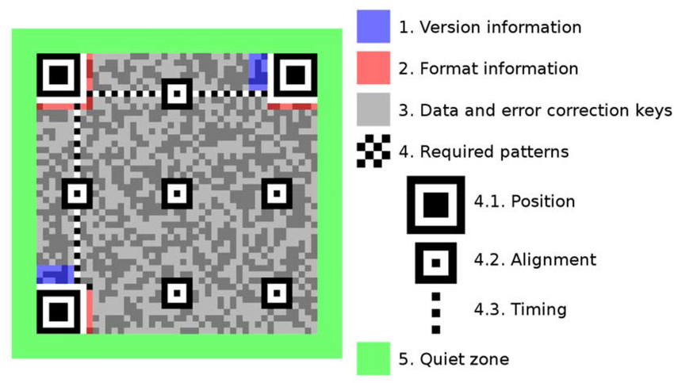
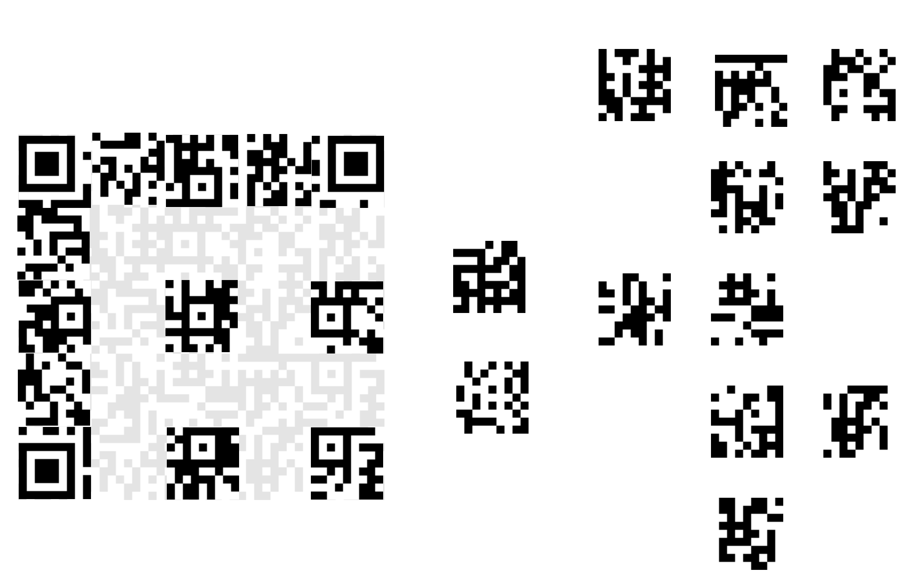

# misc/error-correction Writeup
143 solves | 144 points | Difficulty: Medium  
**TLDR: Unscramble a QR code containing the flag.**
```
Looks like their error correction's no match for my error creation!
```
The challenge consists of 2 files: `chall.png` and chall.py. chall.png is an image of a scrambled QR code and `chall.py` is the script that generates `chall.png`.
## Solve
Analysin the QR image scrambler `chall.py` reveals the generation algorithm. It generates a QR code containing the string `flag` using the segno library with a format version 7, fixed low level error correction, and byte data format, converts it into a monochrome bitmap image, breaks the 45x45 image into 25 9x9 chunks, and writes the shuffled and scaled image into `chall.png`.

The challenge is to reassemble the original code given the 25 chunks. To start, here's a breakdown of the version 7 QR code.  
  
The first of the chunks to be reassembled are the 3 with the position boxes and the 6 with the alignment boxes. All the boxes are distinct, so there is only one position for each of them.

Next are the 4 chunks containing timing, 2 horizontal and 2 vertical. The timing chunks are distinguished by their 7th row or column having an alternating pattern. Because only one of the chunks also matches the version information section in each pair, they all also have only one position.
  
With 12 chunks remaining, it may be tempting to brute force the remaining 12 chunks, but given that the bottom-rightmost chunk is known, it's possible to read the partial bitsteam and using the known bitmask and the fact that the QR code consists of the flag and so contains only printable ASCII, idenfify the blocks that would produce a bitstream that would start with as many printable characters as possible then brute force the rest of the chunks. Because QR codes of this size use interleaved data, the full recounstruction will be needed to obtain the flag.
  

Scanning the code reveals the flag `lactf{Th15_15_pr0b481y_n07_wh47_7h3y_m34n7_8y_3rr0r_c0rr3c710n_CVOD5Jp7IOq+XgR}`