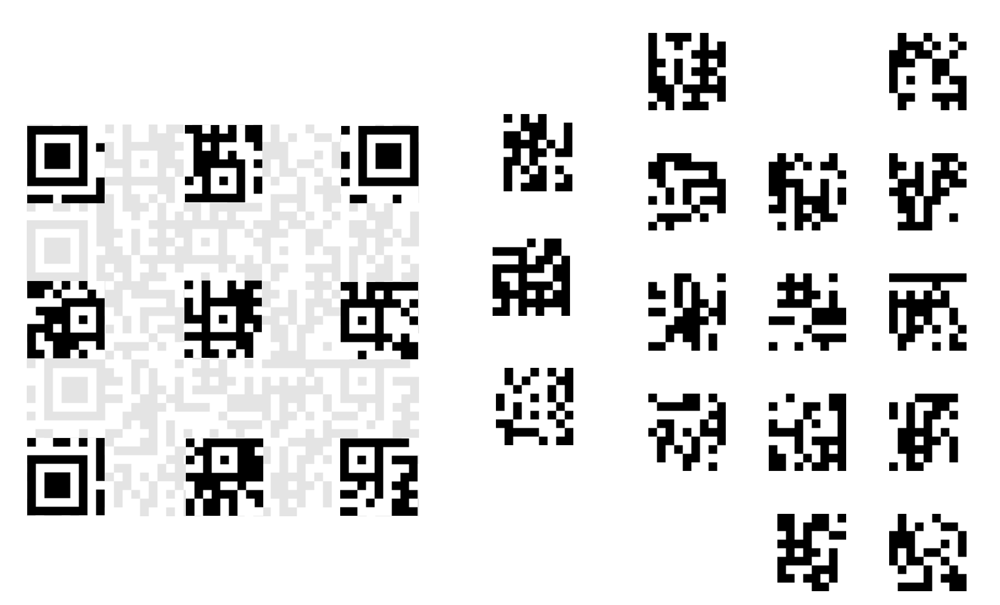
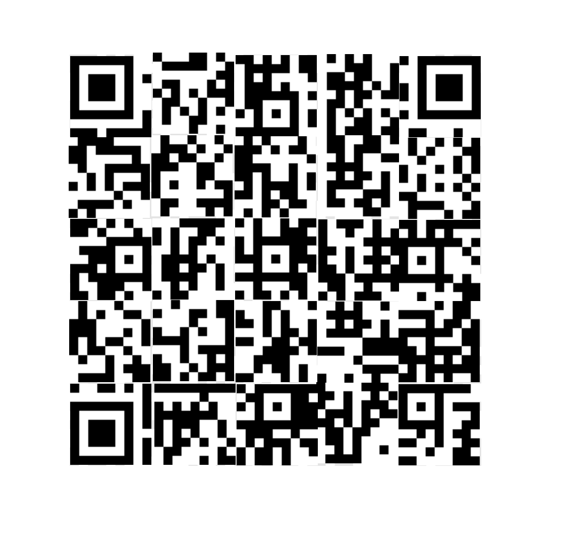

# misc/error-correction Writeup
143 solves | 144 points | Difficulty: Medium  
**TLDR: Unscramble a QR code containing the flag.**
```
Looks like their error correction's no match for my error creation!
```
The challenge consists of 2 files: `chall.png` and chall.py. chall.png is an image of a scrambled QR code and `chall.py` is the script that generates `chall.png`.
## Solve
Analysin the QR image scrambler `chall.py` reveals the generation algorithm. It generates a QR code containing the string `flag` using the segno library with a format version 7, fixed low level error correction, and byte data format, converts it into a monochrome bitmap image, breaks the 45x45 image into 25 9x9 chunks, and writes the shuffled and scaled image into `chall.png`.

The challenge is to reassemble the original code given the 25 chunks. To start, here's a breakdown of the version 7 QR code.  
  
The first of the chunks to be reassembled are the 3 with the position boxes and the 6 with the alignment boxes. All the boxes are distinct in the relative location of their box, so there is only one position for each of them.

Next are the 4 chunks containing timing lines: 2 horizontal and 2 vertical. The chunks are distinguished by having their their 7th row or column from the top-left be an alternative pattern of black and white pixels. It may appear as ther are 4 ways to arrange the two pairs of timing line chunks given their identical timing lines, but fortunately, QR codes of this size also have two fixed chunks next to each timing line indicating the QR code version number (known). This allows both pairs of cunks to be ordered.
  
With 12 chunks remaining, it may be tempting to brute force the remaining 12 chunks, but given that the bottom-rightmost chunk is known, it's possible to read the partial bitsteam and using the known bitmask (part of the sme chunk as the position boxes) and the fact that the QR code consists of the flag `lactf{...}` in bytestring form and so contains only printable ASCII, idenfify the blocks that would produce a bitstream that would start with as many printable characters as possible then brute force the rest of the chunks. Because QR codes of this size use interleaved data, the full recounstruction will be needed to obtain the flag as the bytes in the bytestring itself are scrambled.
  

Scanning the code reveals the flag `lactf{Th15_15_pr0b481y_n07_wh47_7h3y_m34n7_8y_3rr0r_c0rr3c710n_CVOD5Jp7IOq+XgR}`