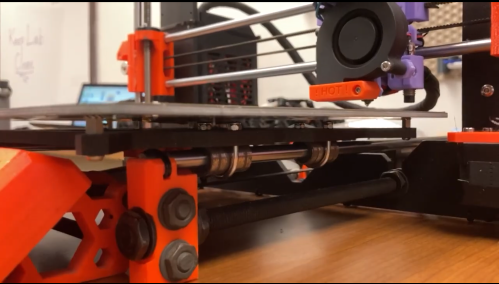
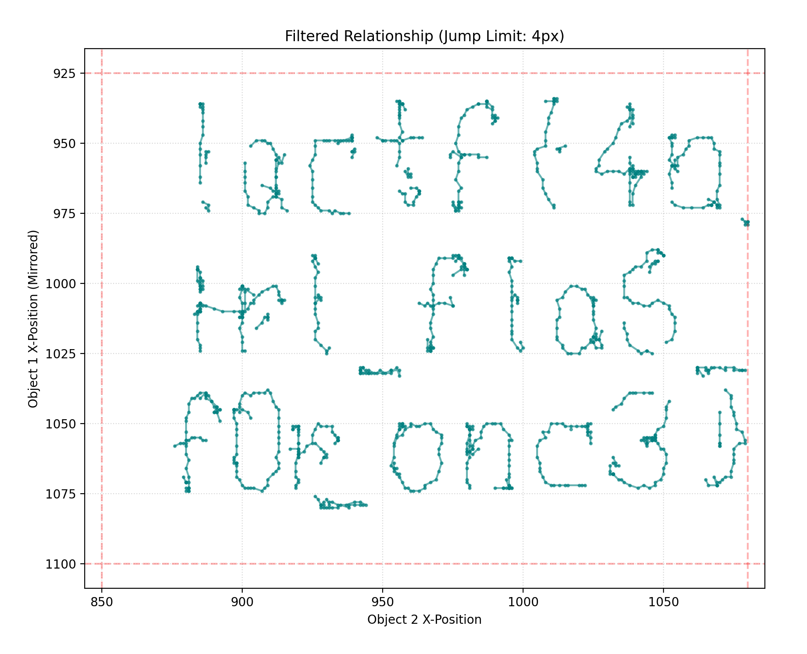

# misc/flag-irl Writeup
36 solves | 278 points | Difficulty: Hard  
**TLDR: Recounstruct a 3D printed flag by tracking printer movements.**
## Description
```
With the generous help of the folks at 3D4E, I finally have a flag that can literally be captured! I made sure to [document this incredible accomplishment](https://www.youtube.com/watch?v=aKpsggYoVnc), though my microphone was busted.
```
For further clarification, this was added halfway through:
```
This is **not** an OSINT challenge, and the video is the only thing you need to solve the challenge. Please do not try to research the challenge author or any other organizations mentioned in the description. It will not help.
```
The challenge consists of a single [Youtube video](https://www.youtube.com/watch?v=aKpsggYoVnc) linked in the description.
## Solve
The linked video is just over 8 minutes long and consists of a 3D printer printing the flag. While not explicitly stated, the challenge is to obtain the flag that is being printed.
  
The printer used in this video is the Prusa MK3s, which is a bedslinger printer. Bedlingers move forwards and backwards by moving the print surcafe of the printer while moving left, right, up, and down by moving the extruder. Since the print is never directly visible in the video, the print hieght is very low, up and down movements aren't significant and can be ignored. This leaves tracking movement in the four directions as the path to recounstructing the flag. Fortunately, since the extruder and the print surface each handle a single axis and are parallel to each other, they are all that is needed to trace the print.

Using the cv library, a script `track.py` is used to take in bounding boxes corresponding to the movement of the extruder and plate and store them into a csv file containing the coordinates of the two on each frame. It's worth mentioning that because the two objects each move on a single axis, only their x-axis positions are needed to trace the extruder's path.

Obtaining the list of coordinates and plotting them directly would just show a flag shape as the majority of those points would come from the printer filling in the flag outline with zig-zag movements. However, if the points are colored in the order they were listed, text begins to appear on the flags.

At this point, it will still be hard to read, so to clean up the text, additional processing will be needed. For example, the flag shape can be removed, leaving just the text itself on the plot. The printer moves faster when it isn't printing than when it is, so filtering out fast printer movements helps to remove lines between characters. After adding a bounding box to isolate the text, the graph should appear similar to this. This is implemented in `plot.py`
  

Despite some of the leftover noise, reading out the characters reveals the final flag `lactf{4n_irl_fla6_f0r_onc3}`
